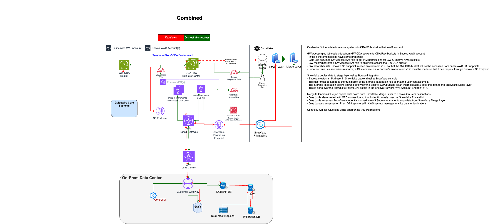

# CDA Terraform stack

This repo contains the terraform code for the cda infrastructure.
More information about this project please view
in [CDA Sharepoint URL](https://encova.sharepoint.com/sites/GuidewireCloudUpgradeProgram/Shared%20Documents/Forms/AllItems.aspx?id=%2Fsites%2FGuidewireCloudUpgradeProgram%2FShared%20Documents%2FCloud%20Data%20Access%20%28CDA%29%2FAWS%20Infra%20Requirements).

# Contents

1. [Introduction](/README#introduction)
2. [Resources](/README#Resources)
3. [Deployment step](/README#Deployment-step)

# Setting up a Development Environment

Welcome! If you're new to the repo check out [Setting up a Development Environment](./docs/setting_up_dev_env.md) for
detailed instructions on setting up your development environment.

# Introduction

This TF code is made up of 5 parts, for higher readability, file naming is in the format of 0_, 1_, 2_ and can be
modified at will.

- **IAM:** Contain iam policy and iam role creation code.
- **kms:** Create KMS key.
- **s3:** Contain S3 creation and S3 object upload code.
- **glue:** Contain glue security group, glue connection creation and glue job creation code.
- **sns:** Contain event rule creation and sns topic creation code.

</img>

# Resources

## IAM Policy

- aws-gbl-cda-&lt;env&gt;-policy-call-glue-0001
- aws-gbl-cda-&lt;env&gt;-policy-call-glue-0003
- aws-gbl-cda-&lt;env&gt;-policy-s3-list-gw-bucket
- aws-gbl-cda-&lt;env&gt;-policy-s3-read-gw-bucket
- aws-gbl-cda-&lt;env&gt;-policy-s3-write-cda-bucket
- aws-gbl-cda-&lt;env&gt;-policy-s3-list-cda-bucket
- aws-gbl-cda-&lt;env&gt;-policy-gw-access-secret (In comment)
- aws-gbl-cda-&lt;env&gt;-policy-snowflake-ms-sql-secret (In comment)
- aws-gbl-cda-&lt;env&gt;-policy-gw-access-list-sns (In comment)
- aws-gbl-cda-&lt;env&gt;-policy-kms-0001
- aws-gbl-cda-&lt;env&gt;-policy-create-log-group

## IAM Role

- aws-gbl-&lt;env&gt;-role-cda-gw-access-0001
  :warning: **Notice** : *This aws-gbl-&lt;env&gt;-role-cda-gw-access-0001 role can be edited & redeployed, but if it is
  redeployed after GW has approved this role ARN, another GW ticket must be raised to re-approve this role, even if the
  ARN is unchanged.*
- aws-gbl-&lt;env&gt;-role-cda-snowflake-storage-integration-0001 (In comment)
- aws-gbl-&lt;env&gt;-role-cda-snowflake-to-ms-sql-0001

## KMS Key

- alias/kms-cda-&lt;env&gt;-0001

## S3 Bucket

- encova-aws-use1-&lt;env&gt;-s3-cda-pc-0001
- encova-aws-use1-&lt;env&gt;-s3-cda-bc-0001
- encova-aws-use1-&lt;env&gt;-s3-cda-cc-0001
- encova-aws-use1-&lt;env&gt;-s3-cda-cm-0001
- encova-aws-use1-&lt;env&gt;-S3-cda-code-0001
- encova-aws-use1-&lt;env&gt;-s3-cda-pc-archive-0001
- encova-aws-use1-&lt;env&gt;-s3-cda-bc-archive-0001
- encova-aws-use1-&lt;env&gt;-s3-cda-cc-archive-0001
- encova-aws-use1-&lt;env&gt;-s3-cda-cm-archive-0001

## Glue security group

- aws-use1-&lt;env&gt;-glue-connection-sg

## Glue connection

- aws-use1-&lt;env&gt;-glue-network-connection

## Glue job

- aws-use1-&lt;env&gt;-glue-cda-gw-access-0001
- aws-use1-&lt;env&gt;-glue-cda-gw-access-0002
- aws-use1-&lt;env&gt;-glue-cda-merge-to-ms-sql-0001

## Event Rule

- event-cda-&lt;env&gt;-glue-job-failures-0001 (In comment)

## SNS Topic

- sns-cda-&lt;env&gt;-glue-job-failures-0001 (In comment)

# Deployment-step

## The following steps are local manual deployment steps for test:

### dev1

- terraform init --backend-config=backends/dev1.s3.tfbackend
- terraform plan -out tfplan -var-file dev1.tfvars
- terraform apply "tfplan"

### qa

- terraform init --backend-config=backends/qa.s3.tfbackend
- terraform plan -out tfplan -var-file qa.tfvars
- terraform apply "tfplan"

## When officially running, we use the Jenkins pipeline to execute Terraform's init, plan, and apply. For detailed steps, please refer to the Dockerfile.
