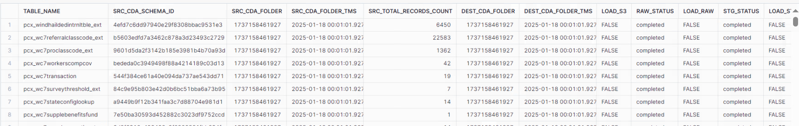

# Guidewire to Snowflake Logic

<!-- TOC -->
* [Guidewire to Snowflake Logic](#guidewire-to-snowflake-logic)
  * [Data Flow Steps](#data-flow-steps)
    * [1. Initial Manifest File Handling](#1-initial-manifest-file-handling)
    * [2. Identify Altered Tables](#2-identify-altered-tables)
    * [3. Retrieve CDA Timestamps](#3-retrieve-cda-timestamps)
    * [4. Collect Parquet File Paths](#4-collect-parquet-file-paths)
    * [5. Copy Files to Encova S3 Bucket](#5-copy-files-to-encova-s3-bucket)
    * [6. S3 to RAW Layer](#6-s3-to-raw-layer)
    * [7. RAW Layer to STG Layer](#7-raw-layer-to-stg-layer)
    * [8. STG Layer to MRG Layer](#8-stg-layer-to-mrg-layer)


<!-- TOC -->

## Data Flow Steps

### 1. Initial Manifest File Handling

- **Source**: The GW system provides a manifest file.
- **Storage**: The manifest file is initially placed into the **GW S3 Bucket**.
- **Folder Structure**: The files in the GW S3 Bucket follow the structure:

  ```
   ├── manifest.json
   ├── table_name/
         ├── fingerprint/
         │    ├── timestamp/
         │    │    ├── file1.snappy.parquet
         │    │    ├── file2.snappy.parquet
         │    │    ├── ...
  ```
  

  **Example:** The following structure is an actual example from GW S3 Bucket:

  
  ```
  pc_account/
    ├── e49cf98d49784abeba7...
    │    ├── 1737158461927/
    │    │    ├── part-00000-3d6e4ddb-9c80-4...
  ```


- **Action**: Copy the manifest file from the **GW S3 Bucket** to the **Encova S3 Bucket**.
- **Batch Status Table**: Insert the record into Batch Status Table with **Started** Status.

---

### 2. Identify Altered Tables

- **Comparison**: Compare the newly copied manifest file in the Encova S3 Bucket with the **manifest table in Snowflake
  **.
    - The Snowflake manifest table contains details like `lastSuccessfulWriteTimestamp` for each table.

  Query used, to generate required Item List
  ```python
  SELECT
  LOWER(SRC_MFST.TABLE_NAME)                            AS TABLE_NAME,
  SRC_MFST.CDA_SCHEMA_ID                                AS SRC_CDA_SCHEMA_ID,
  SRC_MFST.CDA_FOLDER::NUMBER                           AS SRC_CDA_FOLDER,
  SRC_MFST.CDA_FOLDER_TMS                               AS SRC_CDA_FOLDER_TMS,
  SRC_MFST.TOTAL_RECORDS_COUNT                          AS SRC_TOTAL_RECORDS_COUNT,
  DEST_MFST.CDA_FOLDER::NUMBER                          AS DEST_CDA_FOLDER,
  DEST_MFST.CDA_FOLDER_TMS                              AS DEST_CDA_FOLDER_TMS,
  DEST_MFST.CDA_FOLDER_TMS IS NULL
  OR SRC_MFST.CDA_FOLDER_TMS > DEST_MFST.CDA_FOLDER_TMS AS LOAD_S3,
  COALESCE(RAW.STATUS, 'initial')                       AS RAW_STATUS,
  LOAD_S3 OR NOT EQUAL_NULL(RAW.STATUS, 'completed')    AS LOAD_RAW,
  COALESCE(STG.STATUS, 'initial')                       AS STG_STATUS,
  LOAD_RAW OR NOT EQUAL_NULL(STG.STATUS, 'completed')   AS LOAD_STG,
  COALESCE(MRG.STATUS, 'initial')                       AS MRG_STATUS,
  LOAD_STG OR NOT EQUAL_NULL(MRG.STATUS, 'completed')   AS LOAD_MRG
  FROM ETL_CTRL.VW_{self.core_center.upper()}_MANIFEST_DETAILS AS SRC_MFST
  LEFT JOIN ETL_CTRL.JC_{self.core_center.upper()}_MANIFEST_DETAILS AS DEST_MFST
    ON SRC_MFST.TABLE_NAME = DEST_MFST.TABLE_NAME
  LEFT JOIN ETL_CTRL.JC_{self.raw_schema_name.upper()}_LOAD_STATUS AS RAW
    ON LOWER(SRC_MFST.TABLE_NAME) = LOWER(RAW.TABLE_NAME)
  LEFT JOIN ETL_CTRL.JC_{self.stg_schema_name.upper()}_LOAD_STATUS AS STG
    ON LOWER(SRC_MFST.TABLE_NAME) = LOWER(STG.TABLE_NAME)
  LEFT JOIN ETL_CTRL.JC_{self.mrg_schema_name.upper()}_LOAD_STATUS AS MRG
    ON LOWER(SRC_MFST.TABLE_NAME) = LOWER(MRG.TABLE_NAME)
  {"INNER JOIN ETL_CTRL.JC_FREQ_LOAD_TABLE_LIST AS FREQ ON LOWER(SRC_MFST.TABLE_NAME) = LOWER(FREQ.TABLE_NAME) " if self.is_frequent else ""}
  WHERE LOWER(SRC_MFST.TABLE_NAME) != 'heartbeat'
  AND (
  ({self.s3_load_enabled} AND LOAD_S3) OR
  ({self.mrg_load_enabled} AND (LOAD_RAW OR LOAD_STG OR LOAD_MRG))
  )

  ```
- **Output**: Generate a list of altered tables along with their corresponding timestamp folders, schema IDs, etc.

  

---

### 3. Retrieve CDA Timestamps

- **Paginator Use**: For each table, use a paginator to fetch CDA timestamps (folder names) containing the parquet
  files.
  ```python
  paginator = handler.s3_client.get_paginator("list_objects_v2")
  ```


- **Filter Timestamps**:
    - Compare the fetched timestamps with:
        - The **maximum timestamp** from the newly copied manifest file in the Encova S3 Bucket.
        - The **timestamp** stored in the Snowflake manifest table(Last successfully loaded timestamp) for the same
          table.
        - Filtering timestamps Increase efficiency by ensuring only necessary data is processed
    - **Condition**: Include timestamps where:
        - `timestamp <= maxTimestamp from Manifest file in Encova S3 Bucket`
        - `timestamp > timestamp from Snowflake manifest table`
            ```python
                for cda_timestamp_prefix in cda_timestamp_prefixes:
                    cda_timestamp = int(cda_timestamp_prefix.split("/")[-2])
                    if low_bound_cda_timestamp < cda_timestamp <= self.src_cda_folder:
                        yield cda_timestamp_prefix
            ```

---

### 4. Collect Parquet File Paths

- **Filtered List**: Use the filtered list of timestamps to identify directories for the altered tables.
- **Action**: Retrieve all parquet file paths from these directories.
- **Output**: Store these paths in a list.
    ```python
        paginator = self.s3_client.get_paginator("list_objects_v2")
        page_iterator = paginator.paginate(
                Bucket=self.src_bucket,
                Prefix=cda_timestamp_prefix,
            )

        # Filter results for parquet files only.
        parquet_objects = page_iterator.search(
                "Contents[?ends_with(Key, '.snappy.parquet')][]"
            )
    ```


---

### 5. Copy Files to Encova S3 Bucket

- **Action**: Copy all identified parquet files to the **Encova S3 Bucket**.
- **Result**: Parquet files are ready for further processing.
    ```python
            [
                self.copy_file(
                    src_bucket=self.src_bucket,
                    src_path=key_data["Key"],
                    dest_bucket=self.dest_bucket,
                    dest_path=f'{self.dest_prefix}{key_data["Key"].replace(self.src_prefix, "")}',
                )
                for key_data in parquet_objects
            ]
    ```
- **Load Status Table**: Insert Records into Load Status Table in all Schemas (RAW, STG, MRG) with Table Status as **Pending** .
- **Load Manifest Table**: Update the Manifest Table with details like **CDA_SCHEMA_ID,CDA_FOLDER,CDA_FOLDER_TMS,TOTAL_RECORDS_COUNT**. Snowflake manifest table Provides Reliability by acting as a single source of truth for prior processing states.


---

### 6. S3 to RAW Layer

- **Archive Step**: Copy the files in the **Encova S3 Bucket** original folder to the archive folder. Before executing the COPY INTO command, we first move the files from the original folder to the archive folder in the Encova S3 Bucket. This step is critical because COPY INTO deletes the source files after successful ingestion. Archiving beforehand ensures we retain a backup of the raw files.
    ```python
    def move_files_to_archive(self) -> None:
            query = f"""
                COPY FILES INTO @ETL_CTRL.{self.core_center}_STAGE/__copy_into__/__archive__/{self.table_name.lower()}/
                FROM @ETL_CTRL.{self.core_center}_STAGE/__copy_into__/{self.table_name.lower()}/
            """
            self.execute_query(query=query)
    ```

- **Load Status Table**: Update the Load Status Table with **Started** Status
- **Load to Raw Table**: Use the **Snowflake COPY command** to insert the parquet file contents into the raw table.
    ```python
    COPY INTO {self.raw_schema_name}.{self.table_name} (
                    BATCHID,
                    FILE_PATH,
                    TABLE_NAME,
                    CDA_SCHEMA_ID,
                    CDA_FOLDER,
                    CDA_FILE_NAME,
                    CDA_RAW_DATA,
                    ROW_INSERT_TMS
                ) FROM (
                    SELECT {self.batch_id}                                                      AS BATCHID,
                        METADATA$FILENAME                                                    AS FILE_PATH,
                        SPLIT_PART(REPLACE(METADATA$FILENAME, '__copy_into__/', ''), '/', 1) AS TABLE_NAME,
                        SPLIT_PART(REPLACE(METADATA$FILENAME, '__copy_into__/', ''), '/', 2) AS CDA_SCHEMA_ID,
                        SPLIT_PART(REPLACE(METADATA$FILENAME, '__copy_into__/', ''), '/', 3) AS CDA_FOLDER,
                        SPLIT_PART(REPLACE(METADATA$FILENAME, '__copy_into__/', ''), '/', 4) AS CDA_FILE_NAME,
                        $1                                                                   AS CDA_RAW_DATA,
                        CURRENT_TIMESTAMP                                                    AS ROW_INSERT_TMS
                    FROM @ETL_CTRL.{self.core_center}_STAGE/__copy_into__/{self.table_name.lower()}/(
                        FILE_FORMAT => ETL_CTRL.FF_PARQUET_FORMAT,
                        PATTERN => '.*parquet.*'
                    )
                )
                FORCE = {'TRUE' if self.is_initial else 'FALSE'}
                PURGE = TRUE
    ```
- **Record Count**: Get the count of the number of records inserted into the raw table.
    ```python
    if (
                result[0].status is not None
                and "Copy executed with 0 files processed." in result[0].status
            ):
                return 0
            else:
                return sum([row.rows_loaded for row in result])
    ```

- **Load Control Table**: Insert Record into JC_PROCESS_LOG Table.

    ```python
    query = f"""
                INSERT INTO ETL_CTRL.JC_{self.logging_schema_name}_PROCESS_LOG(
                    BATCHID,
                    JOB_NAME,
                    PROCESS_NAME,
                    ROW_COUNT,
                    TABLE_NAME
                )
                VALUES (
                    {self.batch_id},
                    $${self.job_name}$$,
                    $${process}$$,
                    {row_count if row_count is not None else 'NULL'},
                    $${self.table_name.lower()}$$
                )
            """

    ```
- **Duplicate Handling**: Check for any duplicates and delete them from the raw tables.
    ```python
    query = f"""
                DELETE
                FROM {self.raw_schema_name}.{self.table_name} AS TGT
                USING (
                    WITH CPY AS (
                        SELECT
                            REPLACE(RIGHT("file", LEN("file") - 5), '__copy_into__/', '')   AS FILE_SANS_S3,
                            SPLIT_PART(FILE_SANS_S3, '/', 2)                                AS TABLE_NAME,
                            SPLIT_PART(FILE_SANS_S3, '/', 3)                                AS CDA_SCHEMA_ID,
                            SPLIT_PART(FILE_SANS_S3, '/', 4)                                AS CDA_FOLDER,
                            SPLIT_PART(FILE_SANS_S3, '/', 5)                                AS CDA_FILE_NAME
                        FROM TABLE(RESULT_SCAN($${query_id}$$))
                        WHERE "status" = 'LOADED'
                    )
                    SELECT
                        RAW.BATCHID,
                        RAW.TABLE_NAME,
                        RAW.CDA_SCHEMA_ID,
                        RAW.CDA_FOLDER,
                        RAW.CDA_FILE_NAME,
                        RAW.CDA_RAW_DATA,
                        RAW.ROW_INSERT_TMS,
                        ROW_NUMBER() OVER (
                            PARTITION BY
                                RAW.TABLE_NAME,
                                RAW.CDA_SCHEMA_ID,
                                RAW.CDA_FOLDER,
                                RAW.CDA_FILE_NAME,
                                RAW.CDA_RAW_DATA
                            ORDER BY ROW_INSERT_TMS DESC
                        ) AS ROW_NUMBER
                    FROM {self.raw_schema_name}.{self.table_name} AS RAW
                        INNER JOIN CPY
                            ON RAW.TABLE_NAME = CPY.TABLE_NAME
                                AND RAW.CDA_SCHEMA_ID = CPY.CDA_SCHEMA_ID
                                AND RAW.CDA_FOLDER = CPY.CDA_FOLDER
                                AND RAW.CDA_FILE_NAME = CPY.CDA_FILE_NAME
                    QUALIFY ROW_NUMBER > 1
                ) AS SRC
                WHERE TGT.BATCHID = SRC.BATCHID
                    AND TGT.TABLE_NAME = SRC.TABLE_NAME
                    AND TGT.CDA_SCHEMA_ID = SRC.CDA_SCHEMA_ID
                    AND TGT.CDA_FOLDER = SRC.CDA_FOLDER
                    AND TGT.CDA_FILE_NAME = SRC.CDA_FILE_NAME
                    AND TGT.CDA_RAW_DATA = SRC.CDA_RAW_DATA
                    AND TGT.ROW_INSERT_TMS = SRC.ROW_INSERT_TMS;
                    """
    ```


- **Load Audit Table**: Insert Record with details(Manifest table count, RAw Schema count,Diff of Both etc)into Audit Validation Table .
    ```python
    query = f"""
                MERGE INTO ETL_CTRL.JC_{self.core_center.upper()}_AUDIT_COUNT_VALIDATION AS TGT
                USING (
                    WITH
                        CTA AS (
                            SELECT
                                COUNT(*)        AS COUNT,
                                MAX(CDA_FOLDER) AS MAX_CDA_FOLDER
                            FROM {self.raw_schema_name.upper()}.{self.table_name.upper()}
                        )

                    SELECT
                        LOWER('{self.table_name.lower()}')                  AS TABLE_NAME,
                        {self.batch_id}                                     AS BATCH_ID,
                        MFST.TOTAL_RECORDS_COUNT                            AS MANIFEST_TOTAL_RECORDS_COUNT,
                        CTA.COUNT                                           AS RAW_COUNT,
                        COALESCE(MANIFEST_TOTAL_RECORDS_COUNT, 0)
                        - COALESCE(RAW_COUNT, 0)                            AS TOTAL_RECORDS_COUNT_DIFF,
                        MFST.CDA_FOLDER::NUMBER                             AS MANIFEST_CDA_FOLDER,
                        CTA.MAX_CDA_FOLDER                                  AS RAW_CDA_FOLDER,
                        NOT EQUAL_NULL(MANIFEST_CDA_FOLDER, RAW_CDA_FOLDER) AS CDA_FOLDER_DIFF
                    FROM ETL_CTRL.JC_{self.core_center.upper()}_MANIFEST_DETAILS AS MFST,
                        CTA
                    WHERE TABLE_NAME = LOWER('{self.table_name.lower()}')
                ) AS SRC
                    ON SRC.TABLE_NAME = TGT.TABLE_NAME
                        AND SRC.BATCH_ID = TGT.BATCH_ID
                WHEN MATCHED THEN
                    UPDATE SET
                        TGT.MANIFEST_TOTAL_RECORDS_COUNT = SRC.MANIFEST_TOTAL_RECORDS_COUNT,
                        TGT.RAW_COUNT = SRC.RAW_COUNT,
                        TGT.TOTAL_RECORDS_COUNT_DIFF = SRC.TOTAL_RECORDS_COUNT_DIFF,
                        TGT.MANIFEST_CDA_FOLDER = SRC.MANIFEST_CDA_FOLDER,
                        TGT.RAW_CDA_FOLDER = SRC.RAW_CDA_FOLDER,
                        TGT.CDA_FOLDER_DIFF = SRC.CDA_FOLDER_DIFF,
                        TGT.ROW_UPDATE_TMS = CURRENT_TIMESTAMP
                WHEN NOT MATCHED THEN INSERT (
                    TABLE_NAME,
                    BATCH_ID,
                    MANIFEST_TOTAL_RECORDS_COUNT,
                    RAW_COUNT,
                    TOTAL_RECORDS_COUNT_DIFF,
                    MANIFEST_CDA_FOLDER,
                    RAW_CDA_FOLDER,
                    CDA_FOLDER_DIFF
                ) VALUES (
                    SRC.TABLE_NAME,
                    SRC.BATCH_ID,
                    SRC.MANIFEST_TOTAL_RECORDS_COUNT,
                    SRC.RAW_COUNT,
                    SRC.TOTAL_RECORDS_COUNT_DIFF,
                    SRC.MANIFEST_CDA_FOLDER,
                    SRC.RAW_CDA_FOLDER,
                    SRC.CDA_FOLDER_DIFF
                )
            """
    ```

- **Load Status Table**: Update the Load Status Table with **Completed** Status if the stored procedure executed successfully if any Error occures during the stored procedure execution then Update the Load Status Table with **Failed** Status.

---

### 7. RAW Layer to STG Layer

- **Load Status Table**: Update the Load Status Table with **Pending** Status .
- **Schema Comparison**: Compare the column names and data types from the parquet file with the existing stage table to
  check if any new columns have been added.
  ```python
  query=f"""
            WITH
                T AS (
                    SELECT COLUMN_NAME
                    FROM INFORMATION_SCHEMA.COLUMNS
                    WHERE LOWER(TABLE_NAME) = LOWER($${self.table_name}$$)
                        AND LOWER(TABLE_SCHEMA) = LOWER($${self.stg_schema_name}$$)
                )
            SELECT S.COLUMN_NAME || ' ' || S.TYPE AS NEW_COL
            FROM
                (
                    SELECT
                        COLUMN_NAME,
                        TYPE
                    FROM TABLE(
                        INFER_SCHEMA(
                            LOCATION => $$@ETL_CTRL.{self.core_center}_STAGE/__copy_into__/__archive__/{self.table_name.lower()}/$$,
                            FILE_FORMAT => 'ETL_CTRL.FF_PARQUET_FORMAT',
                            FILES => ('{latest_staged_file}')
                        )
                    )
                    ORDER BY ORDER_ID
                ) AS S
                LEFT OUTER JOIN T
                    ON LOWER(T.COLUMN_NAME) = LOWER(S.COLUMN_NAME)
            WHERE T.COLUMN_NAME IS NULL;
            """
  ```
- **Alter Stage Table**: If new columns are found, alter the stage table to include the new columns and update the
  control table.
    ```python
    self.execute_query(
                query=f"""
                ALTER TABLE {self.stg_schema_name}.{self.table_name}
                ADD COLUMN {new_columns_str};
                """
            )
    ```

- **Frame Insert Query**: Construct an insert query to insert records from the raw layer into the stage layer.
    ```python
    query = f"""
                WITH
                    INFERRED_SCHEMA AS (
                        SELECT
                            UPPER(COLUMN_NAME) AS COLUMN_NAME,
                            ORDER_ID,
                            EXPRESSION
                        FROM
                            TABLE(
                                INFER_SCHEMA(
                                    LOCATION => $$@ETL_CTRL.{self.core_center}_STAGE/__copy_into__/__archive__/{self.table_name.lower()}/$$,
                                    FILE_FORMAT => 'ETL_CTRL.FF_PARQUET_FORMAT',
                                    FILES => ('{latest_staged_file}')
                                )
                            )
                            ORDER BY ORDER_ID
                    )

                SELECT
                    COLUMN_NAME,
                    EXPRESSION,
                    IFF(
                        EXPRESSION != COLUMN_NAME,
                        REPLACE(EXPRESSION, '$1', 'CDA_RAW_DATA') || ' AS ' || COLUMN_NAME,
                        COLUMN_NAME
                    ) AS ALIASED_EXPRESSION
                FROM (
                    SELECT
                        COLUMN_NAME,
                        ORDER_ID,
                        EXPRESSION
                    FROM INFERRED_SCHEMA
                    UNION
                    SELECT
                        COLUMN_NAME,
                        NULL AS ORDER_ID,
                        EXPRESSION
                    FROM (
                        VALUES ('CDA_SCHEMA_ID', 'CDA_SCHEMA_ID'),
                        ('CDA_FOLDER', 'CDA_FOLDER'),
                        ('CDA_FILE_NAME', 'CDA_FILE_NAME'),
                        ('BATCHID', $${self.batch_id}$$),
                        ('ROW_INSERT_TMS', 'CURRENT_TIMESTAMP')
                    ) AS DEFAULT_COLS (
                        COLUMN_NAME,
                        EXPRESSION
                    )
                ) AS SUB
                ORDER BY ORDER_ID NULLS LAST;
            """
    ```
- Fetch records from the raw table where the **batch ID** is greater than the max batch ID in the stage table.
- **Execute Insert**: Insert the filtered records into the stage table.
    ```python
        results = self.execute_query(query=insert_statement)
        rows_loaded = results[0]["number of rows inserted"]
    ```

- **Update Control Table**: Insert Record into JC_PROCESS_LOG Table and also Insert Record with details(RAW Schema count,STG Schema Count,Diff of Both etc) into Audit Validation Table .
    ```python
    self.insert_into_jc_process_log(
                process=f"{'created' if self.is_initial else 'insert into'} stg table",
                row_count=rows_loaded,
            )

            self.merge_into_audit_count_validation()
    ```
- **Load Status Table**: Update the Load Status Table with **Completed** Status if the stored procedure executed successfully if any Error occures during the stored procedure execution then Update the Load Status Table with **Failed** Status.

---

### 8. STG Layer to MRG Layer

- **Load Status Table**: Update the Load Status Table with **Pending** Status.

- **Schema Comparison**: Compare the column names and data types of the **merge table** with the **stage table** to
  check if any new columns have been added.
  ```python
  query = f"""
            WITH
                MRG_COLS AS (
                    SELECT COLUMN_NAME
                    FROM INFORMATION_SCHEMA.COLUMNS
                    WHERE LOWER(TABLE_NAME) = LOWER($${self.table_name}$$)
                        AND LOWER(TABLE_SCHEMA) = LOWER($${self.mrg_schema_name}$$)
                ),

                STG_COLS AS (
                    SELECT
                        COLUMN_NAME,
                        CASE
                            WHEN DATA_TYPE = 'NUMBER'
                                THEN DATA_TYPE || ' (' || NUMERIC_PRECISION || ',' || NUMERIC_SCALE::VARCHAR || ')'
                            WHEN DATA_TYPE = 'TEXT'
                                THEN DATA_TYPE || ' (' || CHARACTER_MAXIMUM_LENGTH::VARCHAR || ')'
                            WHEN DATA_TYPE IN ('TIMESTAMP_NTZ', 'TIMESTAMP_LTZ')
                                THEN DATA_TYPE || ' (' || DATETIME_PRECISION::VARCHAR || ')'
                            ELSE DATA_TYPE
                        END AS DATA_TYPE
                    FROM INFORMATION_SCHEMA.COLUMNS
                    WHERE LOWER(TABLE_NAME) = LOWER($${self.table_name}$$)
                        AND LOWER(TABLE_SCHEMA) = LOWER($${self.stg_schema_name}$$)
                        AND COLUMN_NAME NOT IN ('CDA_SCHEMA_ID', 'CDA_FOLDER', 'CDA_FILE_NAME')
                )

            SELECT STG_COLS.COLUMN_NAME || ' ' || STG_COLS.DATA_TYPE AS NEW_COL
            FROM STG_COLS
                LEFT OUTER JOIN MRG_COLS
                    ON LOWER(MRG_COLS.COLUMN_NAME) = LOWER(STG_COLS.COLUMN_NAME)
            WHERE MRG_COLS.COLUMN_NAME IS NULL;
                """
  ```

- **Alter Merge Table**: If new columns are found, alter the merge table to include the new columns and update the
  control table.
  ```python
  self.execute_query(
            query=f"""
            ALTER TABLE {self.mrg_schema_name}.{self.table_name}
            ADD COLUMN {new_columns_str};
            """
        )
  self.insert_into_jc_process_log(
            process="altered mrg table",
        )
  ```

- **Delete Existing Records**: As we are maintaining **SCD Type 1**, get the incremental record IDs from the stage table
  and delete the matching records from the merge table.
  ```python
  query = f"""
            DELETE
            FROM {self.mrg_schema_name}.{self.table_name}
            WHERE ID IN (
                    SELECT DISTINCT ID
                    FROM {self.stg_schema_name}.{self.table_name}
                    WHERE BATCHID > (SELECT MAX(BATCHID) FROM {self.mrg_schema_name}.{self.table_name})
                        AND GWCBI___OPERATION != 1
                );
                """
  ```
- **Update Control Table**: After deletion, update the control table with the number of records deleted.
    ```python
    self.insert_into_jc_process_log(
                process="delete from mrg table",
                row_count=result[0]["number of rows deleted"],
            )
    ```

- **Frame Insert Query**:
    - Get the column names from the stage table to frame the insert query.
        ```python
        query = f"""
                SELECT LISTAGG(COLUMN_NAME, ',') WITHIN GROUP (ORDER BY ORDINAL_POSITION) AS COLUMNS
                FROM INFORMATION_SCHEMA.COLUMNS
                WHERE TABLE_NAME = UPPER('{self.table_name}')
                    AND TABLE_SCHEMA = UPPER('{self.stg_schema_name}')
                    AND COLUMN_NAME NOT IN (
                        'CDA_SCHEMA_ID',
                        'CDA_FOLDER',
                        'CDA_FILE_NAME',
                        'BATCHID',
                        'ROW_INSERT_TMS'
                    );
        ```

    - Construct an insert query to insert records from the stage layer into the merge layer.
    - Fetch records from the **stage table** where the **batch ID** is greater than the max batch ID in the merge table.
        ```python
        query = f"""
                INSERT INTO {self.mrg_schema_name}.{self.table_name} (
                    GW_DELETE_FLAG,
                    BATCHID,
                    ROW_INSERT_TMS,
                    ROW_UPDATE_TMS,
                    {columns}
                )
                SELECT
                    IFF(GWCBI___OPERATION = '1', 'Y', 'N') AS GW_DELETE_FLAG,
                    {self.batch_id},
                    CURRENT_TIMESTAMP::TIMESTAMP_NTZ       AS ROW_INSERT_TMS,
                    CURRENT_TIMESTAMP::TIMESTAMP_NTZ       AS ROW_UPDATE_TMS,
                    {columns}
                FROM (
                    SELECT {columns}
                    FROM {self.stg_schema_name}.{self.table_name}
                    WHERE BATCHID > (SELECT COALESCE(MAX(BATCHID), 0) FROM {self.mrg_schema_name}.{self.table_name})
                        AND GWCBI___OPERATION != '1'
                    QUALIFY ROW_NUMBER() OVER (
                        PARTITION BY ID
                        ORDER BY
                            CDA_FOLDER DESC,
                            GWCBI___SEQVAL_HEX DESC,
                            GWCBI___LSN DESC
                    ) = 1
                );
        ```
- **Execute Insert**: Insert the filtered records into the merge table.
- **Update Control Table**: Record the number of inserted records into the control table.
    ```python
    self.insert_into_jc_process_log(
                process="insert into mrg table",
                row_count=row_insert_count,
            )

    ```

- **Update `gw_delete_flag`**: Set the **`gw_delete_flag`** column with its respective value determined based on the *
  *`GWCBI__OPERATION`** column.
  ```python
  batch_id_filter = f"""
            AND BATCHID > (
                SELECT COALESCE(MAX(BATCHID), 0)
                FROM {self.mrg_schema_name}.{self.table_name}
                WHERE BATCHID < (SELECT MAX(BATCHID) FROM {self.mrg_schema_name}.{self.table_name})
            )
        """
        query = f"""
            UPDATE {self.mrg_schema_name}.{self.table_name}
            SET
                GW_DELETE_FLAG = 'Y',
                BATCHID        = {self.batch_id},
                ROW_UPDATE_TMS = CURRENT_TIMESTAMP
            WHERE ID IN (
                    SELECT DISTINCT ID
                    FROM {self.stg_schema_name}.{self.table_name}
                    WHERE GWCBI___OPERATION = '1' {'' if self.is_initial else batch_id_filter}
                )
        """
  ```

- **Audit Validation**: Insert Record into JC_PROCESS_LOG Table and also Insert Record with details(STG Schema count,MRG Schema Count,Diff of Both etc) into Audit Validation Table .
    ```python
    query = f"""
                MERGE INTO ETL_CTRL.JC_{self.core_center.upper()}_AUDIT_COUNT_VALIDATION AS TGT
                USING (
                    WITH
                        MRG AS (
                            SELECT COUNT(*) AS COUNT
                            FROM {self.mrg_schema_name.upper()}.{self.table_name.upper()}
                        ),

                        STG AS (
                            SELECT
                                COUNT(DISTINCT ID) AS EXPECTED_MRG_COUNT,
                                COUNT(*)           AS COUNT
                            FROM {self.stg_schema_name.upper()}.{self.table_name.upper()}
                            WHERE GWCBI___OPERATION != 1
                        )

                    SELECT
                        LOWER('{self.table_name.lower()}') AS TABLE_NAME,
                        {self.batch_id}                    AS BATCH_ID,
                        STG.COUNT                          AS STG_COUNT,
                        MRG.COUNT                          AS MRG_COUNT,
                        STG.EXPECTED_MRG_COUNT             AS EXPECTED_MRG_COUNT,
                        EXPECTED_MRG_COUNT - MRG_COUNT     AS EXPECTED_MRG_COUNT_DIFF
                    FROM MRG,
                        STG
                ) AS SRC
                    ON SRC.TABLE_NAME = TGT.TABLE_NAME
                        AND SRC.BATCH_ID = TGT.BATCH_ID
                WHEN MATCHED THEN
                    UPDATE SET
                        TGT.STG_COUNT = SRC.STG_COUNT,
                        TGT.MRG_COUNT = SRC.MRG_COUNT,
                        TGT.EXPECTED_MRG_COUNT = SRC.EXPECTED_MRG_COUNT,
                        TGT.EXPECTED_MRG_COUNT_DIFF = SRC.EXPECTED_MRG_COUNT_DIFF,
                        TGT.ROW_UPDATE_TMS = CURRENT_TIMESTAMP
                WHEN NOT MATCHED THEN INSERT (
                    TABLE_NAME,
                    BATCH_ID,
                    STG_COUNT,
                    MRG_COUNT,
                    EXPECTED_MRG_COUNT,
                    EXPECTED_MRG_COUNT_DIFF
                ) VALUES (
                    SRC.TABLE_NAME,
                    SRC.BATCH_ID,
                    SRC.STG_COUNT,
                    SRC.MRG_COUNT,
                    SRC.EXPECTED_MRG_COUNT,
                    SRC.EXPECTED_MRG_COUNT_DIFF
                );
            """
    ```
- **Load Status Table**: Update the Load Status Table with **Completed** Status if the stored procedure executed successfully if any Error occures during the stored procedure execution then Update the Load Status Table with **Failed** Status. insert_into_jc_batch_status

- **Batch Status Table**: Update the Batch Status Table with **Completed** Status, if any Error occures during the Process execution then Update the Batch Status Table with **Failed** Status.
---
