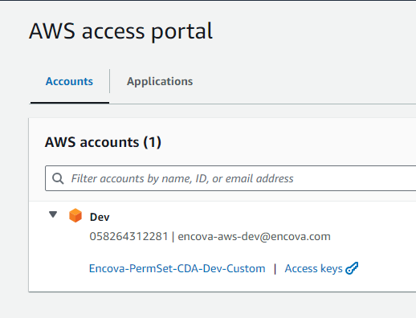
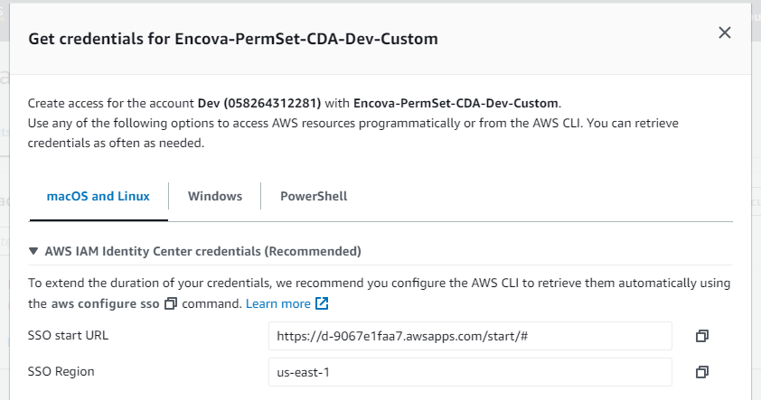
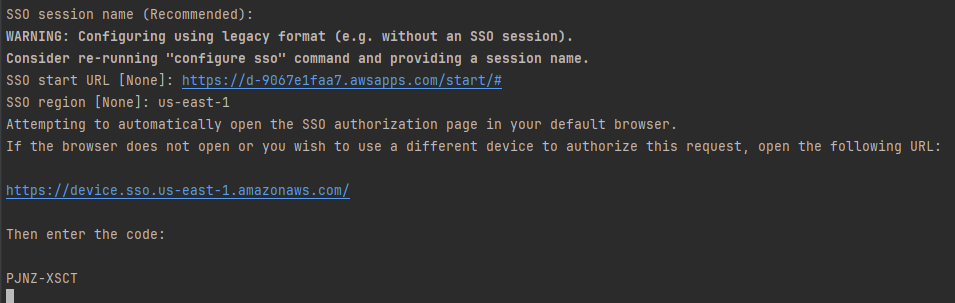
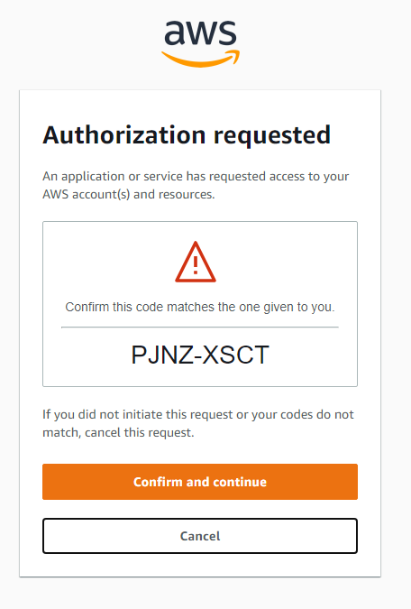
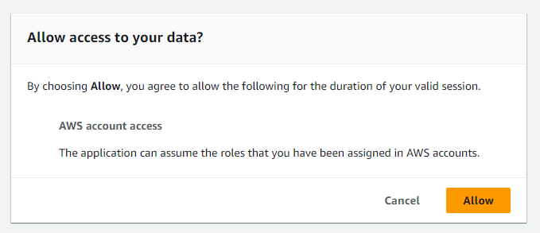
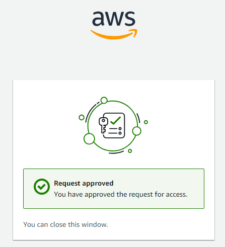
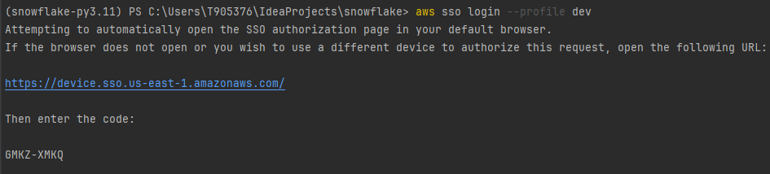
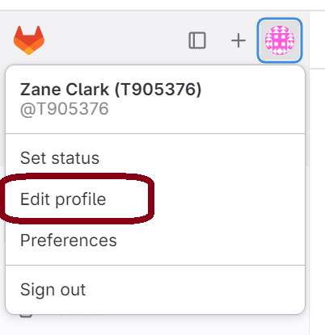
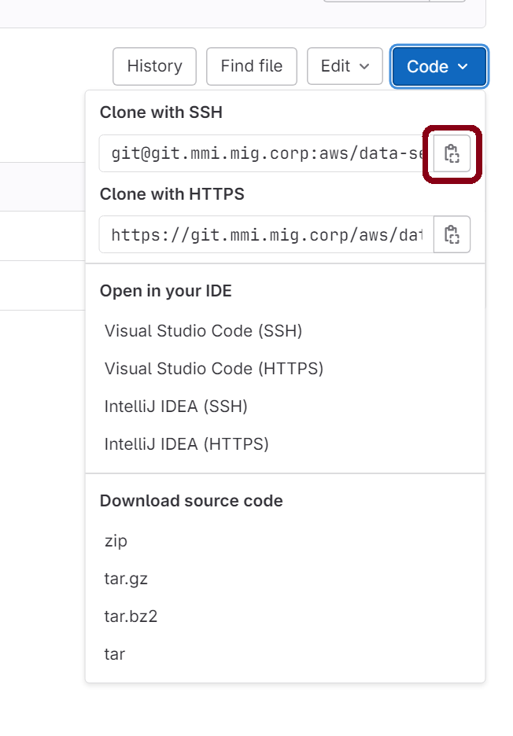
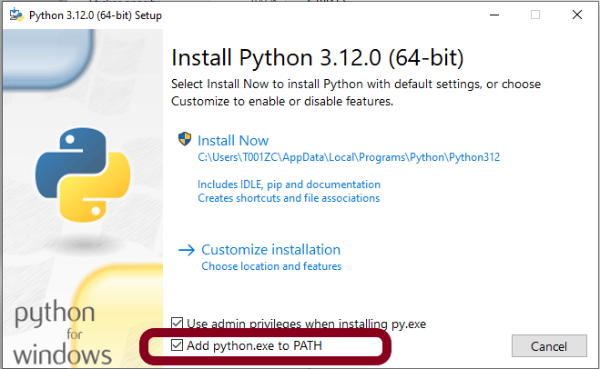

# Setting up a Development Environment

<!-- TOC -->
* [Setting up a Development Environment](#setting-up-a-development-environment)
  * [Install GitBash](#install-gitbash)
  * [Create an SSH Key Pair](#create-an-ssh-key-pair)
  * [Configure AWS SSO](#configure-aws-sso)
  * [Reauthenticate with AWS SSO](#reauthenticate-with-aws-sso)
  * [Add Public SSH Key to GitLab Profile](#add-public-ssh-key-to-gitlab-profile)
  * [Set Git User Name and Email](#set-git-user-name-and-email)
  * [Clone the Repository](#clone-the-repository)
  * [Install an IDE](#install-an-ide)
    * [Configuring VS Code](#configuring-vs-code)
  * [Install Python Dependencies](#install-python-dependencies)
  * [Spark](#spark)
<!-- TOC -->

## Install GitBash

Windows users should use [Git Bash](https://git-scm.com/download/win) or PowerShell for git operations.

## Create an SSH Key Pair

GitHub's [official documentation](https://docs.gitlab.com/ee/user/ssh.html) on configuring SSH Key Authentication is
very thorough. The following configuration is the most basic configuration:

1. Generate a key pair.
   ```bash
   ssh-keygen -t ed25519 -C "john.doe@encova.com"
   ```
2. Press Enter to accept the default path.
   ```
   Generating public/private ed25519 key pair.
   Enter file in which to save the key (/home/user/.ssh/id_ed25519):
   ```
3. Specify a passphrase. Record this value in a secure location for future use.
   ```
   Enter passphrase (empty for no passphrase):
   Enter same passphrase again:
   ```
4. Create a file at `~/.ssh/config` with the following contents:
   ```
   Host git.mmi.mig.corp
     PreferredAuthentications publickey
     IdentityFile ~/.ssh/id_ed25519
   ```
5. When you created the key above, a public key was also created. Copy that key to your clipboard to add to your GitLab
   profile (next step).
   ```
   cat ~/.ssh/id_ed25519.pub | clip
   ```

## Configure AWS SSO

1. Install the [AWS CLI](https://docs.aws.amazon.com/cli/latest/userguide/getting-started-install.html).
2. Launch the sso wizard:
   ```bash
   aws configure sso
   ```

3. Press enter to leave the SSO session blank.
4. Navigate to the AWS Access Portal, select the chevron to the left of the `Dev` account, and select "Access keys".

   
5. Use the values under `AWS IAM Identity Center credentials (Recommended)` as the SSO Start URL and SSO Region.

   

6. Press enter to accept the default SSO registration scope: `sso:account:access`
7. The CLI will display a code and attempt to open up a browser. Select `Confirm and continue` if the values match.

   
   
8. Select "Accept" to proceed

   

9. When you reach this window, you can close the browser tab

   
10. Navigate back to the CLI. If you have multiple roles available, you will be asked to select a role.
11. Set the default CLI region
    ```bash
    CLI default client Region [None]: us-east-1
    ```
12. Set the default CLI output format to `json`
    ```bash
    CLI default output format [None]: json
    ```

13. Set the profile name. Note: You will need to type this value in daily. Recommended name: `dev`
    ```bash
    CLI profile name [Encova-PermSet-CDA-Dev-Custom-058264312281]: dev
    ```

## Reauthenticate with AWS SSO

The token issued by authenticating with AWS via SSO is only good for a few hours. If you attempt to use an expired
token, a token-related exception will occur. To get a new token:

1. Execute the following, replacing `YOUR_PROFILE_NAME` with the profile name that you configured above:

   ```bash
   aws sso login --profile YOUR_PROFILE_NAME
   ```
2. The CLI will display a code and attempt to open up a browser. Select `Confirm and continue` if the values match.

   
3. Allow access on the subsequent screen.

## Add Public SSH Key to GitLab Profile

1. Sign in to GitLab.
2. On the left sidebar, select your avatar.

   
3. Select Edit profile.

   
4. On the left sidebar, select SSH Keys.

   
5. Select Add new key.

   
6. In the Key box, paste the contents of your public key. Naming the key is useful if you will have multiple devices
   with a key (e.g. a laptop and a desktop). You can optionally alter the expiration date.

   
7. Select "Add Key" to save the key to your profile.

## Set Git User Name and Email

Git will require
a name and an email to be associated with each commit. Run the following command in a Powershell or Git
Bash terminal determine if you have already configured your name:

```bash
git config user.name
```

If your name isn't returned, run the following command to set it, replacing your name where appropriate:

```bash
git config --global user.name "your name here, punctuation is fine"
```

Let's do the same for your email:

```bash
git config user.email
```

If your email isn't returned, run the following command to set it. Use your _actual_ email here (
e.g. `zane.clark@encova.com`).

```bash
git config --global user.email "zane.clark@encova.com"
```

## Clone the Repository

1. (Optional) If you don't already have one, create a local directory for git projects and navigate to that directory.
   ```bash
   mkdir ~/Encova_Projects && cd ~/Encova_Projects
   ```
2. Navigate to the [repo main page](https://git.mmi.mig.corp/aws/data-services/snowflake) and select the "Clone"
   button.

   

3. Next to "Clone with SSH", select "Copy URL"

   
4. In your GitBash terminal, type `git clone` and paste the URL from your clipboard. Execute the command.
   ```shell
   git clone git@git.mmi.mig.corp:aws/data-services/snowflake.git
   ```

## Install an IDE

Install an IDE that can connect to Snowflake:

1. [Visual Studio Code](https://code.visualstudio.com/download) has an official Snowflake Connector.
2. Certain [JetBrains](https://www.jetbrains.com/) products have database connection features (IntelliJ, DataGrip).

Open the locally-cloned repository with your IDE and establish a database connection. This will allow you to write,
execute, and commit your change scripts from the same place. It will also offer up some nice features:

- IntelliSense for database objects
- Automatic SQL formatting

### Configuring VS Code

1. Enable [Autosave](https://code.visualstudio.com/docs/editor/codebasics#_save-auto-save).
2. Install the [Python Extension](https://marketplace.visualstudio.com/items?itemName=ms-python.python)
3. Install the [GitLens Extension](https://marketplace.visualstudio.com/items?itemName=eamodio.gitlens)
    - After you install this extension, select `Ctrl` + `Shift` + `P` and search for `GitLens: Hide Pro Features`.
      Select this. It will ensure that you don't click on a button only to be disappointed by a pay wall.

## Install Python Dependencies

1. Install [Python 3.11](https://www.python.org/downloads/release/python-3119/). **Don't install anything newer than
   3.11. During the installation, ensure that you add Python to PATH.** There's an option to do so in the first step
   of the process.

   
2. (Optional) Create a virtual environment. If you are using Python for multiple projects on your computer, you can end
   up with conflicting dependencies. For example, Project A wants 1.1.1 and Project B wants 1.2.3. You can support both
   requirements with [virtual environments](https://docs.python.org/3/library/venv.html) for each project. Each virtual
   environment has an independent set of Python packages. While working on Project A, you have access to the required
   1.1.1 dependency. While working on Project B, you have access to the required 1.2.3 dependency.
    1. Using Powershell, navigate to the `snowflake` directory.
    2. Create a virtual environment. This will create a `.venv` folder in the directory that will house your Python
       dependencies.
       ```bash
       python -m venv .venv
       ```
    3. Manually activate the virtual environment. When a virtual environment is activated, your terminal will have
       display the name of the virtual environment to the left of the prompt. The command will depend on which terminal
       you are using.
        - Powershell: `.venv\Scripts\Activate.ps1`
        - cmd: `.venv\Scripts\activate.bat`
    4. To automatically activate your virtual environment, register your virtual environment with your IDE:
        * VS Code:
            1. Open the Command Palette (Ctrl+Shift+P)
            2. Find and select "Python: Select Interpreter"

               
            3. Select the interpreter at the path `.\.venv\Scripts\python.exe`
            4. Now, every terminal you open with this project will automatically activate the virtual environment!
3. Ensure that you're using the latest version of pip:
   ```bash
   python.exe -m pip install --upgrade pip
   ```
4. Install Python dependencies. If you previously set up a virtual environment, ensure that it's active before you
   execute the following:
   ```bash
   pip install -r requirements-additional.txt
   pip install -r requirements-glue-defaults.txt
   ```

## Spark

To execute Glue code with Spark references locally (e.g. [sf_to_ms_sql_mrg.py](../glue_scripts/sf_to_ms_sql_mrg.py))
you will need to take additional steps:

1. Clone the [winutils](https://github.com/cdarlint/winutils) repo locally. Take note of the local file path, as you'll
   need it for the next step.
2. Edit your system environment variables:
    - Create a new variable: `HADOOP_HOME`. Set the value equal to the `winutils` file path on your local machine with
      the targeted Hadoop version appended. For example, if your local path was
      `C:\Users\T905376\git_projects\winutils`, set `HADOOP_HOME` equal to
      `C:\Users\T905376\git_projects\winutils\hadoop-3.2.0` to target `3.2.0`
    - Add the `bin` folder of the `HADOOP_HOME` directory to the `PATH` environment variable. Using the above example,
      you would add `C:\Users\T905376\git_projects\winutils\hadoop-3.2.0\bin` to `PATH`
3. Install [Java SE Development Kit 11](https://www.oracle.com/java/technologies/javase/jdk11-archive-downloads.html)
    1. Download the `Windows x64 Installer`
    2. Run the installer
    3. Set your `JAVA_HOME` environment variable to the the location of the Java SE 11 install (e.g.
       `C:\Program Files\Java\jdk-11`).
4. Restart your IDE or computer to ensure that environment variable changes are reflected in all processes.
